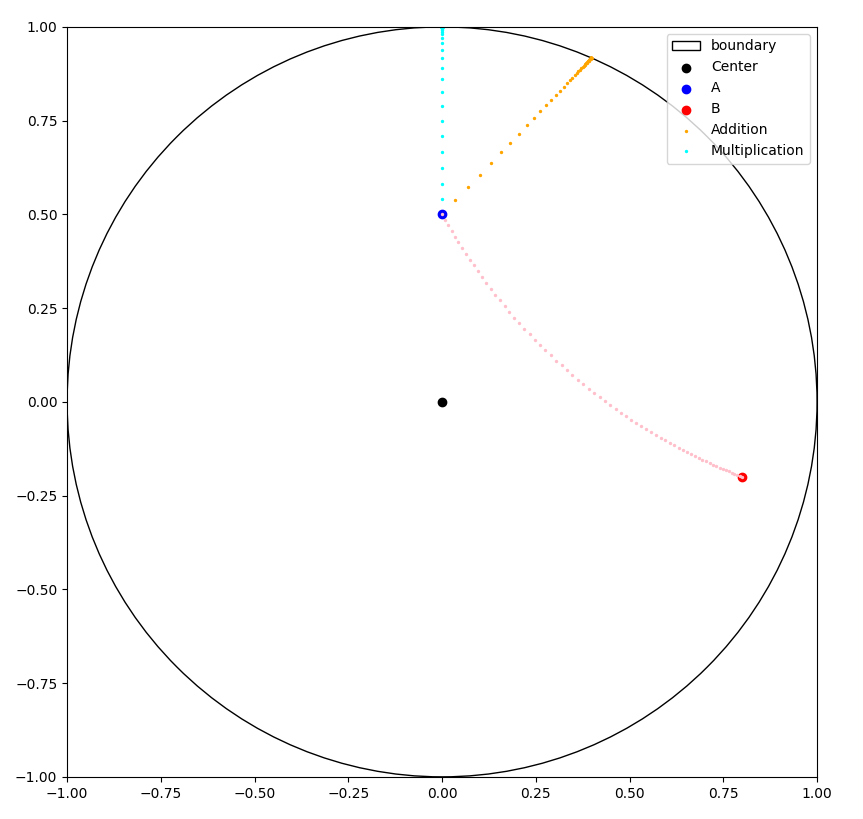

# Gyrovectors

This project is based on [Gyrogroups, the Grouplike Loops in the Service of Hyperbolic Geometry and Einstein's Special Theory of Relativity](https://arxiv.org/abs/1303.0218).

## Installation

```bash
pip install -r requirements.txt
```

## Usage

```python
import numpy as np
from gyrovectors import get_backend, mob_add

back = get_backend("numpy") # tells that we are using numpy arrays
radius = 1 # we work in a disk of radius 1

a = np.array([0.0, 0.5])
b = np.array([-0.0, 0.3])

c = mob_add(a, b, radius, back) # Möbius addition of a and b
```

## Example

Running the script `hello_world.py` should plot the following :

